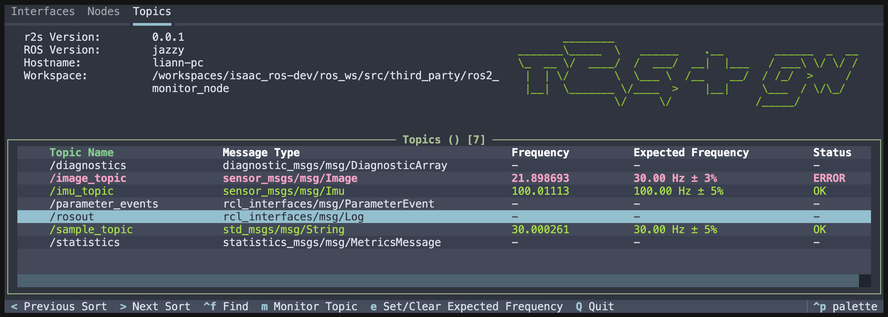
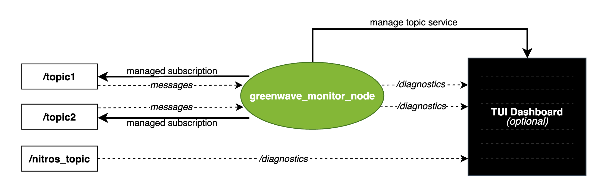

# Greenwave Monitor
Greenwave monitor is a tool for runtime monitoring of ROS 2 topics.



It provides the following features:

1. A node similar to a C++ based ros2 topic hz. I.E. subscribes to topics to determine the frame rate and latency. compared to ros2 topic hz the greenwave node is more performant, publishes Diagnostics, and offers services to manage topics and expected frequencies.

2. A terminal based dashboard that displays the topic rates, latency, and status, and allows you to add/remove topics and set expected frequencies.

3. A header only C++ library so you can calculate and publish compatible diagnostics directly from your own nodes for reduced overhead.

This diagram shows an overview of the 

## Diagnostic messages

The diagnostics messages published by greenwave monitor are valid ROS 2 Diagnostics messages, however the dashboard does rely on specific keys to associate the data with the correct topic, and to find frequency and latency data.

In particular, the messages follow conventions from [Isaac ROS NITROS](https://github.com/NVIDIA-ISAAC-ROS/isaac_ros_nitros), which means configured NITROS nodes can be monitored by greenwave monitor frontends without any additional subscriber overhead. For example the drivers from [Isaac ROS NOVA](https://github.com/NVIDIA-ISAAC-ROS/isaac_ros_nova) can be monitored out of the box. Furthermore, you can set `ENABLE_GLOBAL_NITROS_DIAGNOSTICS=1` to configure all NITROS nodes to publish diagnostics (more info [here](https://nvidia-isaac-ros.github.io/repositories_and_packages/isaac_ros_nitros/isaac_ros_nitros/index.html)).

## Compatibility

Greenwave monitor is a standalone package tested on Humble, Iron, Jazzy, Kilted, and Rolling ROS 2 releases, under Ubuntu 22.04 and Ubuntu 24.04. It does not depend on Isaac ROS.

## Installation

From source:
```bash
cd ros_ws/src
git clone https://github.com/NVIDIA-ISAAC-ROS/greenwave_monitor.git
cd ..
colcon build --packages-up-to greenwave_monitor
source install/setup.bash
```

## Usage

Greenwave monitor provides two dashboard frontends, a lightweight ncurses interface and a rich terminal interface (a fork of [r2s](https://github.com/mjcarroll/r2s)). Note we rename the fork r2s_gw to avoid conflicts with the original r2s package.

We have found that the r2s dashboard gets sluggish when there are many topics, so we recommend using the ncurses dashboard for large deployments.

#### ncurses Dashboard (Lightweight)

After installing, you can launch the ncurses dashboard with:

```bash
ros2 run greenwave_monitor ncurses_dashboard
```

You can also launch the dashboard with some demo publishers to see everything in action:

```bash
ros2 run greenwave_monitor ncurses_dashboard -- --demo
```

### r2s_gw Dashboard (Rich TUI)

First you need to build the r2s_gw package and some additional dependencies, r2s_gw is included in the greenwave_monitor package.

```bash
cd ros_ws/
colcon build --packages-up-to r2s_gw
pip install -I textual # There is a requirements.txt file in the r2s_gw package, but in case you installed from debian and that's not handy ...
source install/setup.bash
```

Then you can launch the dashboard with the following. Use tab to navigate between different UI elements.

```bash
ros2 run greenwave_monitor r2s_gw_dashboard
```

Just like before, you can also launch the dashboard with some demo publishers to see everything in action.

```bash
ros2 run greenwave_monitor r2s_gw_dashboard -- --demo
```

### Manual Launch (ros2 topic hz mode)

You can of course also launch the node standalone, or incorporate it into your own launch files.
If you want to use it as a command line tool, you can do so with the following launch file:

```bash
ros2 launch greenwave_monitor hz.launch.py topics:='["/topic1", "/topic2"]'
```